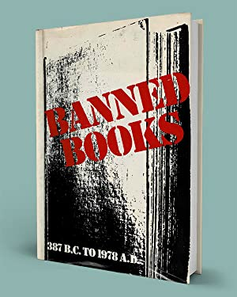
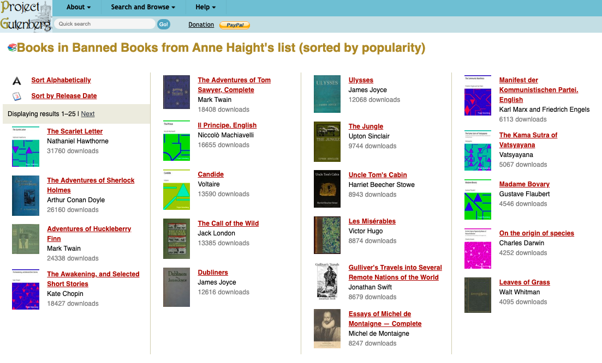
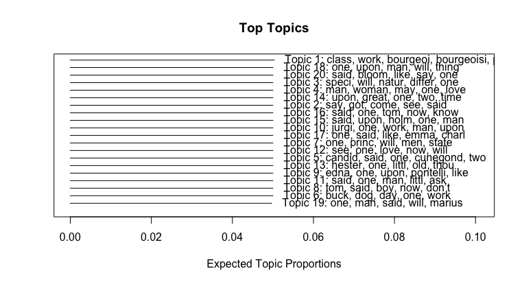
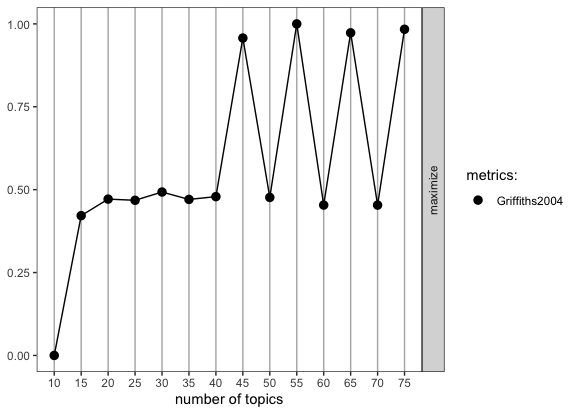
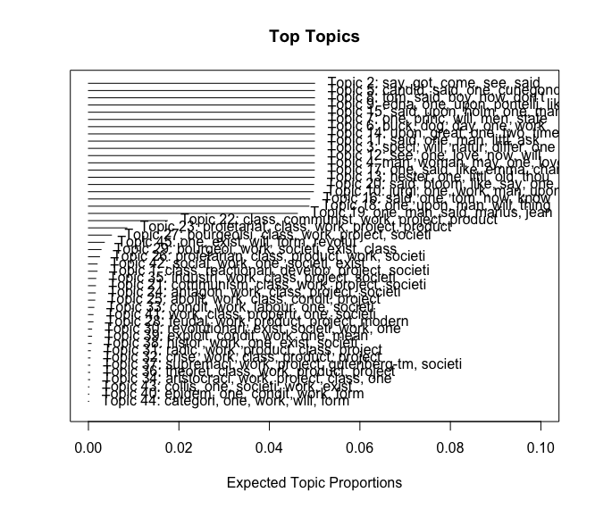
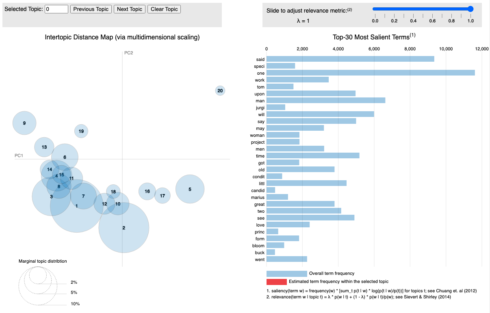
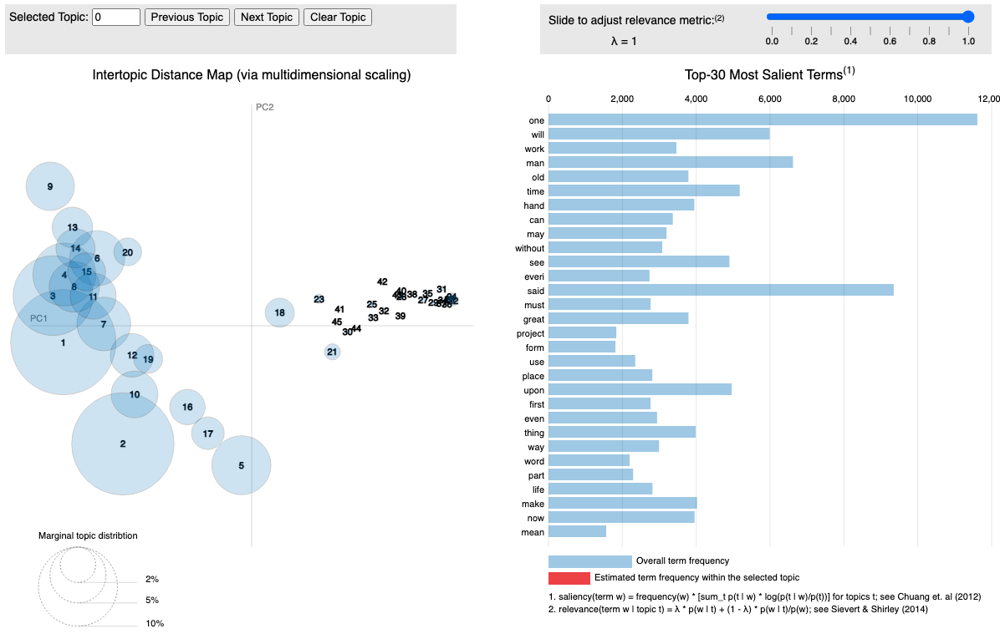
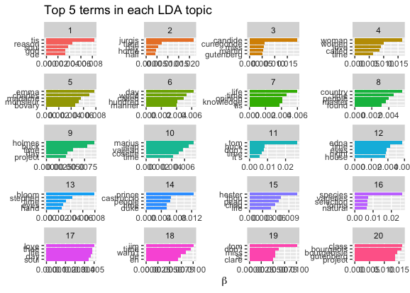

```{r setup, include=FALSE}
knitr::opts_chunk$set(echo = TRUE)
```

```{r, echo=FALSE, message=FALSE, warning=FALSE}
library(tidyverse)
library(tidytext)
library(wordcloud2)
library(forcats)
library(gutenbergr)
library(dplyr)
library(readtext) 
library(ggplot2)
library(SnowballC)
library(topicmodels)
library(stm)
library(ldatuning)
library(knitr)
library(LDAvis)

banned_books <- readtext("banned_books/*")

banned_books_tidy <- banned_books %>% 
  rename(book = doc_id) %>%
  na.omit() %>% 
  unnest_tokens(word, text) %>%
  anti_join(stop_words)

banned_counts <- banned_books_tidy %>%
  filter(word != "project") %>%
  filter(word != "gutenberg") %>%
  filter(word != "de") %>%
  filter(word != "tis") %>%
  filter(word != "tm") %>%
  filter(word != "chapter") %>%
  count(word, sort = TRUE) 

# banned_frequencies <- banned_books_tidy %>%
#   filter(word != "project") %>%
#   filter(word != "gutenberg") %>%
#   filter(word != "de") %>%
#   filter(word != "tis") %>%
#   filter(word != "tm") %>%
#   filter(word != "chapter") %>%
#   count(book, word, sort = TRUE) %>%
#   group_by(book) %>%
#   mutate(proportion = n / sum(n))

# banned_dtm <- banned_books_tidy %>%
#   count(book, word) %>%
#   cast_dtm(book, word, n)

# temp <- textProcessor(banned_books$text, 
#                       metadata = banned_books,  
#                       lowercase=TRUE, 
#                       removestopwords=TRUE, 
#                       removenumbers=TRUE,  
#                       removepunctuation=TRUE, 
#                       wordLengths=c(3,Inf),
#                       stem=TRUE,
#                       onlycharacter= FALSE, 
#                       striphtml=TRUE, 
#                       customstopwords=NULL)

# meta <- temp$meta
# vocab <- temp$vocab
# docs <- temp$documents
# 
# stemmed_books <- banned_books %>%
#   unnest_tokens(output = word, input = text) %>%
#   anti_join(stop_words, by = "word") %>%
#   mutate(stem = wordStem(word))
# 
# stemmed_dtm <- banned_books %>%
#   unnest_tokens(output = word, input = text) %>%
#   anti_join(stop_words, by = "word") %>%
#   mutate(stem = wordStem(word)) %>%
#   count(word, stem, sort = TRUE) %>%
#   cast_dtm(word, stem, n)
# 
# banned_lda <- LDA(banned_dtm, 
#                   k = 20, 
#                   control = list(seed = 588)
# )

# docs <- temp$documents 
# meta <- temp$meta 
# vocab <- temp$vocab 
# 
# banned_stm <- stm(documents=docs, 
#                   data=meta,
#                   vocab=vocab, 
#                   K=20,
#                   max.em.its=25,
#                   verbose = FALSE)

## plot.STM(banned_stm, n = 5)

# k_metrics <- FindTopicsNumber(
#   banned_dtm,
#   topics = seq(10, 75, by = 5),
#   metrics = "Griffiths2004",
#   method = "Gibbs",
#   control = list(),
#   mc.cores = NA,
#   return_models = FALSE,
#   verbose = FALSE,
#   libpath = NULL
# )

## FindTopicsNumber_plot(k_metrics)

## toLDAvis(mod = banned_stm, docs = docs)
```

## What I did

I returned to Project Gutenberg to see if I could shed any additional light onto my original word count/frequency analysis. As a reminder, my corpus consists of the top 20 most popular books on Project Gutenberg from Anne Haight's 1978 publication: *'Banned books: informal notes on some books banned for various reasons at various times and in various places'*

<center>

</center>

<center>https://catalog.lib.ncsu.edu/catalog/NCSU233622 </center>

## Purpose:

My original goal with my first independent analysis was to determine if there is indeed anything particularly risqué that shows up at the level of individual words in some commonly banned/challenged books. The results were intriguing, if pretty limited. 

My goal with applying topic modeling methods is to see if a more nuanced analysis emerges. (spoiler: still no.)

## My dataset 

* I looked at the top 20 most popular titles on Project Gutenberg mentioned in Anne Haight's 1978 pubication: *'Banned books: informal notes on some books banned for various reasons at various times and in various places'*
* Why these books? 
  + Most of today's banned/challenged books are not in the public domain! 
  + I went with the top 20 most popular to keep things manageable for this learning experience --- Anne Haight's full list contains 178 books on PG.
  
## My dataset

{width="85%"}

## Methods

* Text of the books obtained by using the 'gutenbergr' and 'readtext' packages
* Data processing -- tokenized, tidied, stemmed text
* Data analysis -- basic word counts & frequencies, topic modeling using lda, stm

## Most common words

```{r, eval=T, echo=F}
wordcloud2(banned_counts,
           color = ifelse(banned_counts[, 2] > 1330, 'black', 'gray'))
```

## Most common words

```{r, eval=T, echo=F}
banned_counts %>%
  filter(n > 1330) %>% 
  mutate(word = reorder(word, n)) %>% 
  ggplot(aes(n, word)) + #
  geom_col() +
  labs(x = "Word Counts", y = NULL) + 
  theme_minimal()
```

## My original conlusions based on counts & frequencies...

"Normally, comparing such disparate texts as *"Uncle Tom's Cabin"*, *"The Communist Manifesto"*, and *"The Kama Sutra"* wouldn't really make sense. But in this case, wherein their uniting theme is ~commonly banned or challenged~, it is worthwhile (and just plain fun) to see if, as a whole, they live up to their hype.

In the end, nothing particularly salacious showed up in this word level analysis. Just timeless themes of, well, **"time"**, in addition to **"life", "people", "love", "death",** & **"god"**."

## Now to introduce topic modeling:

I went with 20 topics for my stm analysis, somewhat arbitrarily but there was some logic to it since the corpus consists of 20 books. 

{width="85%"}

And, it seems, the books topics were segregated by book. 

## Finding K

The answer to my dilemma would seem to be that I need a different number of topics. 

Using FindTopicsNumber and FindTopicsNumber_plot() from the ldatuning package revealed the following: 

## Finding K

{width="85%"}

## Is more always better?

I did play around with what 45 topics looked like instead, but found that it just really overrepresented The Communist Manifesto, so the rest of this analysis is based on the 20 topic starting point. 

## 20 topics > 45 topics

{width="85%"}

## LDAvis explorer for 20 topics

{width="85%"}

## LDAvis explorer for 45 topics

{width="85%"}

## Top terms in each topic

{width="85%"}


## Conclusions for banned books round 2

This (very basic) application of topic modeling to my banned book corpus was in the end not very helpful. It was disappointing but unsurprising that the books siloed themselves into topics, and only further proves that comparing them all as one hulking corpus doesn't really make sense. (also: it took a long time to run all of this code!)

If I were to stick with this for my final project, I think it would be better to construct topic models for each individual book and then compare them against one another. 

## Conclusions for banned books round 2, cont. 

There is also definitely a lot of merit to some of the suggestions made by Matthew L. Jockers' in his blog post '“Secret” Recipe for Topic Modeling Themes'.

- it would make a load of difference if I created a list of custom stop words for each book that includes all character names
- the notion of "chunking" that he presents would also be a good next step

> “By chunking each novel into smaller pieces, we allow the model to discover themes that occur only in specific places within novels and not just across entire novels."


